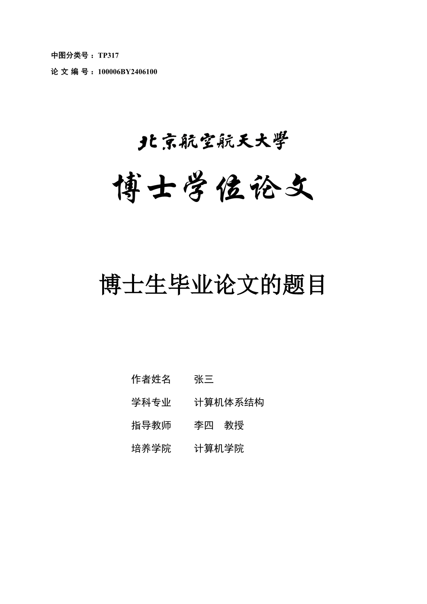

<p align="center">
  <a href="https://www.buaa.edu.cn" rel="noopener noreferrer">
    
  </a>
</p>

<br />

# 现代化北航研究生毕业论文模板

北航研究生毕业论文 **[Typst](https://typst.app)** 模板，能够快速、准确的生成北航研究生毕业论文。

- 📦 开箱即用，你只需要专注于写作
- 🔑 100% 遵循了北航最新的论文格式文件，比 Word 还原的更加准确
- 🔩 直接包含了 [lovelace](https://typst.app/universe/package/lovelace)、[subpar](https://typst.app/universe/package/subpar) 等工具包，用于伪代码和编排子图编辑

> ⚠️ **警告**: 这并不官方的模板，虽然严格遵循了相关的规范，但没有 Word 版本！！愚蠢的格式检查系统貌似不支持 PDF？？

## 快速开始

查看 [thesis.typ](https://github.com/wangjq4214/buaa-thesis/blob/main/template/thesis.typ) 和 [thesis.pdf](https://github.com/wangjq4214/buaa-thesis/blob/main/example/thesis.pdf)，可以查看具体的代码和生成的 PDF 文件。

这个软件包只提供了一个主要的 API 用于编写你自己的毕业论文，极大的简化了写作过程：

```typ
#import "@preview/modern-buaa-thesis:0.1.0": thesis

#show thesis.with()

= 绪论

= 技术点1

= 技术点2

= 技术点3
```

<p align="center">
  <a href="./example/thesis.pdf" rel="noopener noreferrer">
    
  </a>
</p>

## 路线图

- [ ] 实现硕士毕业论文的支持
- [ ] 实现非工科毕业论文的支持
- [ ] 实现开题报告、中期报告的支持（或许是新的包？）

## 开源协议

[MIT](./LICENSE).

## 贡献

- 欢迎外部的贡献，贡献者可以 fork 这个仓库，修改后合并
- 代码审查、软件包发布将由 [wangjq4214](https://github.com/wangjq4214) 负责
- 如果有问题，可以在 [issue](https://github.com/wangjq4214/buaa-thesis/issues) 中进行讨论！！
