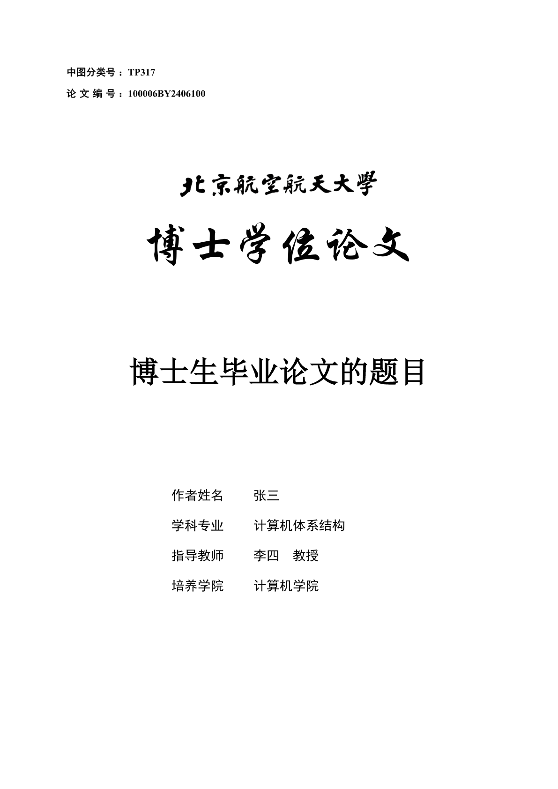

<p align="center">
  <a href="https://www.buaa.edu.cn" rel="noopener noreferrer">
    
  </a>
</p>

<br />

# 现代化北航研究生毕业论文模板

面向北京航空航天大学研究生毕业论文的 **[Typst](https://typst.app)** 模板。模板内置完整的北航论文结构，你可以专注于正文写作，封面、前置页、正文格式、参考文献和附录都由模板统一处理。

- 📦 一个 `thesis` API 生成完整论文版式
- 🎓 覆盖北航研究生论文常见格式要求，包括封面、声明页、章节标题、图表标题、页眉和页码
- 🧩 内置算法块、子图、GB/T 7714 参考文献、盲审模式和打印模式等实用功能

> **提示**：这是社区维护的非官方模板。提交前请务必结合学校和学院的最新要求检查生成的 PDF。

## 🚀 快速开始

从 Typst Universe 引入模板，然后用 `thesis.with(...)` 包裹正文：

```typ
#import "@preview/modern-buaa-thesis:0.4.0": abstract, abstract-en, thesis

#let abstract-zh = [
  #show: abstract.with(keyword: ("Typst", "北航", "毕业论文"))
  这里填写中文摘要。
]

#let abstract-en-text = [
  #show: abstract-en.with(keyword: ("Typst", "BUAA", "Thesis"))
  This is the English abstract.
]

#show: thesis.with(
  type: "doctor",
  title: (zh: [博士学位论文题目], en: [A PhD Thesis Title]),
  author: (zh: [张三], en: [San Zhang]),
  teacher: (zh: [李四], en: [Si Li]),
  teacher-degree: (zh: [教授], en: [Prof.]),
  college: (zh: [计算机学院], en: [School of Computer Science and Engineering]),
  major: (
    discipline: [计算机科学与技术],
    direction: [分布式系统],
    discipline-first: [计算机科学与技术],
    discipline-direction: [计算机系统结构],
  ),
  date: (
    start: [2021年09月01日],
    end: [2026年06月30日],
    summit: [2026年06月10日],
    defense: [2026年06月10日],
  ),
  degree: (zh: [工学博士], en: [Doctor of Philosophy]),
  lib-number: [TP317],
  stu-id: [BY2406100],
  abstract: abstract-zh,
  abstract-en: abstract-en-text,
  bibliography: read("ref.bib"),
)

= 绪论

= 方法

= 实验
```

完整示例可以查看 [template/thesis.typ](https://github.com/wangjq4214/buaa-thesis/blob/0.4.0/template/thesis.typ)，渲染效果可以查看 [example/thesis.pdf](https://github.com/wangjq4214/buaa-thesis/blob/0.4.0/example/thesis.pdf)。

<p align="center">
  <a href="https://github.com/wangjq4214/buaa-thesis/blob/0.4.0/example/thesis.pdf" rel="noopener noreferrer">
    
  </a>
</p>

## ✨ 功能特性

### 📚 完整论文结构

`thesis.with(...)` 会生成完整的论文外壳：

- 中文封面、英文封面、题名页和声明页
- 中文摘要和英文摘要
- 目录、插图清单和附表清单
- 符合北航论文习惯的正文标题、页眉页脚、图表标题、公式编号和引用格式
- 参考文献、学术成果、致谢和作者简介等附录内容

当前支持的论文类型：

| 类型         | 用途           |
| ------------ | -------------- |
| `master`     | 学术型硕士论文 |
| `pro-master` | 专业型硕士论文 |
| `doctor`     | 博士论文       |

### 🧮 算法块

模板导出 `pseudocode-list`，这是一个适合论文写作的伪代码工具，灵感来自 [lovelace](https://typst.app/universe/package/lovelace)。它可以放在 `kind: "algorithm"` 的 `figure` 中，因此算法会和正文中的图表一样获得统一编号和引用格式。

```typ
#import "@preview/modern-buaa-thesis:0.4.0": font-type, pseudocode-list

#figure(
  kind: "algorithm",
  placement: top,
  pseudocode-list(booktabs: true, numbered-title: [贪心分组算法], full: true)[
    - *输入：* 设备集合 $D$，阈值 $epsilon$
    - *输出：* 分组结果 $G$

    + 将每台设备初始化为独立分组
    + *while* 存在可合并候选 *do*
      + 选择代价最小的候选对
      + *if* 代价小于 $epsilon$ *then*
        + 合并候选对
      + *end*
    + *end*
    + #text(font: font-type.kai, [返回最终分组])
  ],
  caption: [贪心分组算法],
) <algo:greedy>

如 @algo:greedy 所示，...
```

常用选项：

| 选项             | 说明                               |
| ---------------- | ---------------------------------- |
| `numbered-title` | 在算法块内部显示算法编号和标题     |
| `line-numbering` | 控制行号；设为 `none` 可隐藏行号   |
| `booktabs`       | 使用论文风格的顶部、中部和底部横线 |
| `full`           | 让算法块占用可用行宽               |

### 🕶️ 盲审模式

生成盲审版本时设置 `blind-review: true`：

```typ
#show: thesis.with(
  // ...
  blind-review: true,
)
```

盲审模式会在 PDF 中隐藏敏感身份信息：

- 封面和声明页中的学号、作者、导师和签名栏
- 结构化学术成果列表中的作者或成员姓名
- 附录中的致谢和作者简介会自动省略

### 🖨️ 打印模式

准备双面打印版本时设置 `is-print: true`：

```typ
#show: thesis.with(
  // ...
  is-print: true,
)
```

打印模式会在生成的封面页之间插入额外分页，使前置页更适合双面打印装订。

### 🔖 参考文献和引用

模板集成 [gb7714-bilingual](https://typst.app/universe/package/gb7714-bilingual)，并导出 `multicite` 用于组合引用：

```typ
#import "@preview/modern-buaa-thesis:0.4.0": multicite, thesis

#show: thesis.with(
  bibliography: read("ref.bib"),
)

相关工作包括 #multicite[@heDeepResidualLearning2016 @vaswaniAttentionAllYou2023]。
```

传入 `bibliography` 后，模板会初始化 GB/T 7714 数字制参考文献格式，并在附录区域渲染参考文献。

### 🏅 学术成果和附录

除了直接传入自由排版的 `achievement`、`acknowledgements` 和 `cv` 内容，模板还提供结构化成果列表工具：

```typ
#import "@preview/modern-buaa-thesis:0.4.0": achievement-papers, achievement-patents, thesis

#let papers = achievement-papers((
  (
    authors: ([张三], [李四]),
    title: [A Typst Thesis Template],
    venue: [Example Conference],
    year: [2026],
    note: [Accepted],
  ),
))

#let patents = achievement-patents((
  (
    authors: ([张三], [李四]),
    title: [一种排版方法],
    patent-no: [CN000000000],
    year: [2026],
  ),
))

#show: thesis.with(
  // ...
  achievement: [
    #papers
    #patents
  ],
)
```

这些结构化工具会自动配合盲审模式，对个人姓名进行隐藏。

### 🖼️ 图、表、公式和子图

正文格式会自动处理常见学术元素：

- 图和表使用论文要求的中文编号前缀
- 表题位于表格上方
- 公式按章编号
- 一级标题会重置图、表、算法和公式计数器
- `sub-fig` 基于 [subpar](https://typst.app/universe/package/subpar) 提供子图排版能力

当一个图中包含多个子图时，可以使用 `sub-fig`：

```typ
#import "@preview/modern-buaa-thesis:0.4.0": sub-fig

#sub-fig(
  figure(
    image("before.png", width: 100%),
    caption: [优化前],
  ), <fig:before>,
  figure(
    image("after.png", width: 100%),
    caption: [优化后],
  ), <fig:after>,
  columns: (1fr, 1fr),
  caption: [优化结果对比],
  label: <fig:comparison>,
)

@fig:comparison 展示了整体对比，@fig:before 和 @fig:after
分别引用其中的两个子图。
```

### 🔤 字体回退

导出的 `font-type` 字典内置宋体、黑体和楷体的回退字体栈，覆盖 Windows、macOS 和常见开源 CJK 字体。这样在本地和 CI 环境中编译时，文档更容易保持一致。

## ⚙️ 配置项

主入口是 `thesis.with(...)`。

| 参数               | 默认值             | 说明                                               |
| ------------------ | ------------------ | -------------------------------------------------- |
| `type`             | `"master"`         | 论文类型：`"master"`、`"pro-master"` 或 `"doctor"` |
| `title`            | `(zh: [], en: [])` | 中英文论文题目                                     |
| `author`           | `(zh: [], en: [])` | 中英文作者姓名                                     |
| `teacher`          | `(zh: [], en: [])` | 中英文导师姓名                                     |
| `teacher-degree`   | `(zh: [], en: [])` | 导师职称，如教授、副教授等                         |
| `college`          | `(zh: [], en: [])` | 学院名称                                           |
| `major`            | dictionary         | 学科专业、研究方向、一级学科和学科方向             |
| `date`             | dictionary         | 学习时间、提交日期和答辩日期                       |
| `degree`           | `(zh: [], en: [])` | 封面中显示的学位名称                               |
| `lib-number`       | `[]`               | 中图分类号                                         |
| `stu-id`           | `[]`               | 学号                                               |
| `abstract`         | `[]`               | 中文摘要内容                                       |
| `abstract-en`      | `[]`               | 英文摘要内容                                       |
| `conclusion`       | `[]`               | 可选的总结与展望内容                               |
| `bibliography`     | `none`             | BibTeX 内容，通常使用 `read("ref.bib")`            |
| `achievement`      | `[]`               | 学术成果内容                                       |
| `acknowledgements` | `[]`               | 致谢内容，盲审模式下会隐藏                         |
| `cv`               | `[]`               | 作者简介内容，盲审模式下会隐藏                     |
| `is-print`         | `false`            | 是否启用双面打印分页                               |
| `blind-review`     | `false`            | 是否启用匿名盲审输出                               |

## 🗺️ 路线图

- [x] 实现硕士毕业论文的支持（实验性支持，或许仍然存在一些小问题，欢迎 issue 反馈，Thanks [Aerithy](https://github.com/Aerithy)）
- [ ] 实现非工科毕业论文的支持
- [ ] 实现开题报告、中期报告的支持（或许是新的包？）

## 📝 更新日志

### [0.4.0](https://github.com/wangjq4214/buaa-thesis/tree/0.4.0) (2026-06-14)

#### ✨ 新特性

- 添加盲审模式，可通过 `blind-review: true` 开启
- 添加论文、专利和科研项目的结构化成果列表工具
- 为总结与展望章节添加 `chap:conclusion` 标签，方便引用

#### 🐛 错误修复

- 修复页眉字号和页码显示问题
- 修复封面论文编号前缀
- 修复专业硕士学位论文标题表述
- 修复标题引用和目录条目显示问题

#### 📝 文档

- 更新 README 示例和功能说明

### [0.3.0 (💥 BreakChange)](https://github.com/wangjq4214/buaa-thesis/tree/0.3.0) (2026-04-11)

#### 🐛 错误修复

- 修复数学字体展示问题，默认使用 Cambria Math 字体
- 修复参考文献格式问题，感谢 [gb7714-bilingual](https://github.com/pku-typst/gb7714-bilingual)
- 修复参考文献的字符间距问题，使用更加紧凑的英文排版

### [0.2.0 (💥 BreakChange)](https://github.com/wangjq4214/buaa-thesis/tree/0.2.0) (2025-12-29)

#### ✨ 新特性

- 添加了对工学硕士论文的支持，包括学术硕士和专业硕士
- 添加了自定义的算法块，感谢 [lovelace](https://typst.app/universe/package/lovelace) 提供的灵感
- 添加楷书的支持

#### 🐛 错误修复

- 修复公式标号字体为 New Times Roman
- 修复算法块的编号问题
- 修复结论部分标题被错误标号的行为

### [0.1.2](https://github.com/wangjq4214/buaa-thesis/tree/0.1.2) (2025-12-05)

#### ✨ 新特性

- 支持北航研究生毕业论文的最新格式要求（2025.09 版本）

#### 🐛 错误修复

- 修复了字体类型的错误顺序

#### 🛠️ 改进

- 添加了自动更新软件包版本号的脚本

### [0.1.1](https://github.com/wangjq4214/buaa-thesis/tree/0.1.1) (2025-09-28)

#### ✨ 新特性

- 添加了对子图的支持

#### 🐛 错误修复

- 修复了标题引用错误格式
- 修复了错误的参考文献字体类型

### [0.1.0](https://github.com/wangjq4214/buaa-thesis/tree/0.1.0) (2025-07-08)

#### 🎉 首个版本

- 发布了现代化北航论文模板的第一个版本

#### ✨ 新特性

- 添加了对封面的支持
- 添加了对目录的支持
- 添加了对图表目录的支持
- 添加了对章节标题的支持
- 添加了对图表的支持
- 添加了对公式编号的支持
- 添加了对正文格式的支持
- 添加了对参考文献的支持
- 添加了对附录（如个人信息页）的支持

## 📄 开源协议

[MIT](./LICENSE).

## 🤝 贡献

- 欢迎外部贡献，贡献者可以 fork 本仓库并提交修改
- 代码审查、软件包发布将由 [wangjq4214](https://github.com/wangjq4214) 负责
- 如果有问题，可以在 [issue](https://github.com/wangjq4214/buaa-thesis/issues) 中讨论
